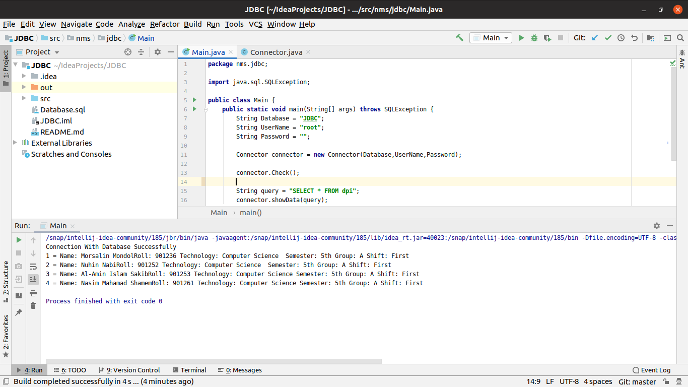

# Java Database Connection With MySQL(PhpMyAdmin => Xampp/Lampp)

##### `SQL`

      CREATE TABLE `TABLE_NAME` (
        `roll` int(11) NOT NULL,
        `semester` text NOT NULL,
        `technology` text NOT NULL,
        `shift` text NOT NULL,
        `group` text NOT NULL,
        `Name` text NOT NULL
      ) ENGINE=InnoDB DEFAULT CHARSET=latin1;
      
      ##### `Or Import Database.sql File on Admin Plnel`

##### `Java Main`

        Create an Object of Connector Class
        
            Connector connector = new Connector(Database,UserName,Password);
            
        To Check Connection   
        
            connector.Check();
            
        Show Data Form Database:
        
            Write Query:
            
                  String query = "SELECT * FROM TABLE_NAME";
                  
            Call showData() Method and Pass Query String: 
            
                  connector.showData(Query);

##### Output 

##### If SQL Driver Issue/Error, Download Driver Form The Link Down Below For Different Platform
https://dev.mysql.com/downloads/connector/odbc/

